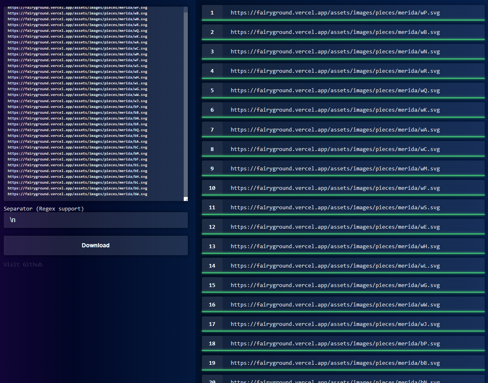

# Simple-Bulk-Downloader
Simply downloads files from URLs in bulk, returns a single ZIP file.

### [[Open Tool]](https://hakorr.github.io/Simple-Bulk-Downloader/)

## Why?

We have browser extensions that promise the world and then make you to download 100 files separately, Python scripts that have a million libraries missing, two decades old command line utilities that require you to read their whole documentation to get going, and software that's so bloated it makes your computer feel like it's running in quicksand.

This bulk downloader can't make you dinner or tell you a bedtime story, but it can download the damn 50 cat pictures you want RIGHT. NOW. Not after you've studied computer science for 4 years to figure out how to use the command line. Just paste the URLs, and press download.

## Heavy usage

Simple Bulk Downloader doesn't yet have a feature to detect ratelimiting, sorry! It's a simple downloader for light usage for now.

## Special Thanks

- [JSZip](https://github.com/Stuk/jszip)
- [FileSaver.js](https://github.com/eligrey/FileSaver.js)
- My last two remaining brain cells
